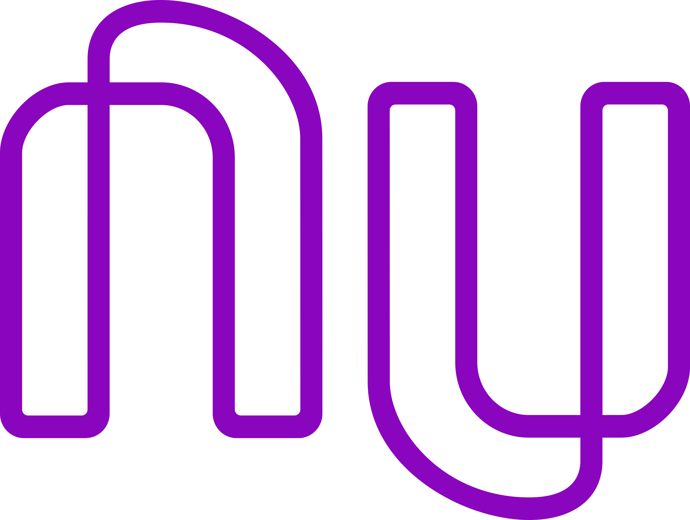

<h1 align="center">
    
</h1>
<h4 align="center">
  NuClone
</h4>

  

  
  
  

  

## Features

- :nail_care: **Styled Components** — Tecnologia para componentizar estilização CSS no React através do Javascript;
- ⚛️ **React Js** — Biblioteca Javascript para construção de interfaces;
- ⚛️ **React Native** — Biblioteca que provê uma maneira eficiente de criar aplicações nativas para Android e iOS;
- :scroll: **Expo** — Framework e plataforma para criar aplicações React, contendo diversas ferramentas para facilitar o desenvolvimento;

## :space_invader: Projeto

O NuClone é um projeto feito para praticar e melhorar minhas habilidades em React e React Native. Neste projeto eu tento clonar as interfaces do aplicativo Mobile da Nubank e sua página web. A ideia partiu do vídeo da <a href="https://youtu.be/DDm0M_rZLJo">RocketSeat</a>, ensinando a recriar a interface do app.

## :iphone: Mobile

  

## 💻 Web

  

Feito com ♥ by Andre Sampaio :wave:
